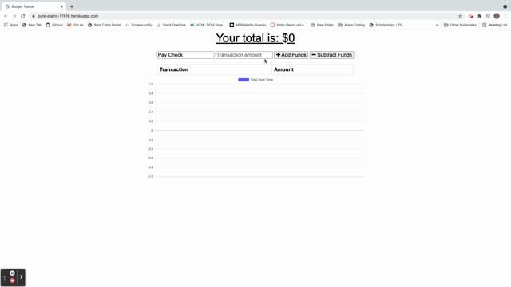

# Budget-Tracker 
                       
## Description
A tracker that will allow users without an internet connection to add expenses and deposits to their budget. When offline, transactions will be stored in an IndexedDB. 

## Table of Contents
- [Installation](#installation)
- [Usage](#usage)
- [License](#license)
- [Questions](#questions)

## Installation
<ul>
<li> In root directory, enter command <b>npm i</b></li>
<li> Then command <b> npm start </b> </li>
</ul>
The project will deploy at <a href = "localhost:300"> localhost:3000</a>
    
## Usage
<ol>
<li> Enter the name of the transaction </li> 
<li> Enter the transaction amount </li>
<li> Select <b> Add Funds </b> or <b> Subtract Funds</b> </li>
</ol>
Your total and chart will be automatically updated. 

<a href = "https://pure-plains-17816.herokuapp.com/"> Deployed Heroku Application </a>

## License 
<h3> MIT: </h3>
<ul> <li> <a href = "https://opensource.org/licenses/MIT"> MIT License </a></li> <li> This project is licensed under MIT</li> </ul>

## Questions
<ul> <li><a href = "https://github.com/janeijones">GitHub Profile </li>
<li> <a href = "https://pure-plains-17816.herokuapp.com/">Visit Heroku Deployed Site</li>
